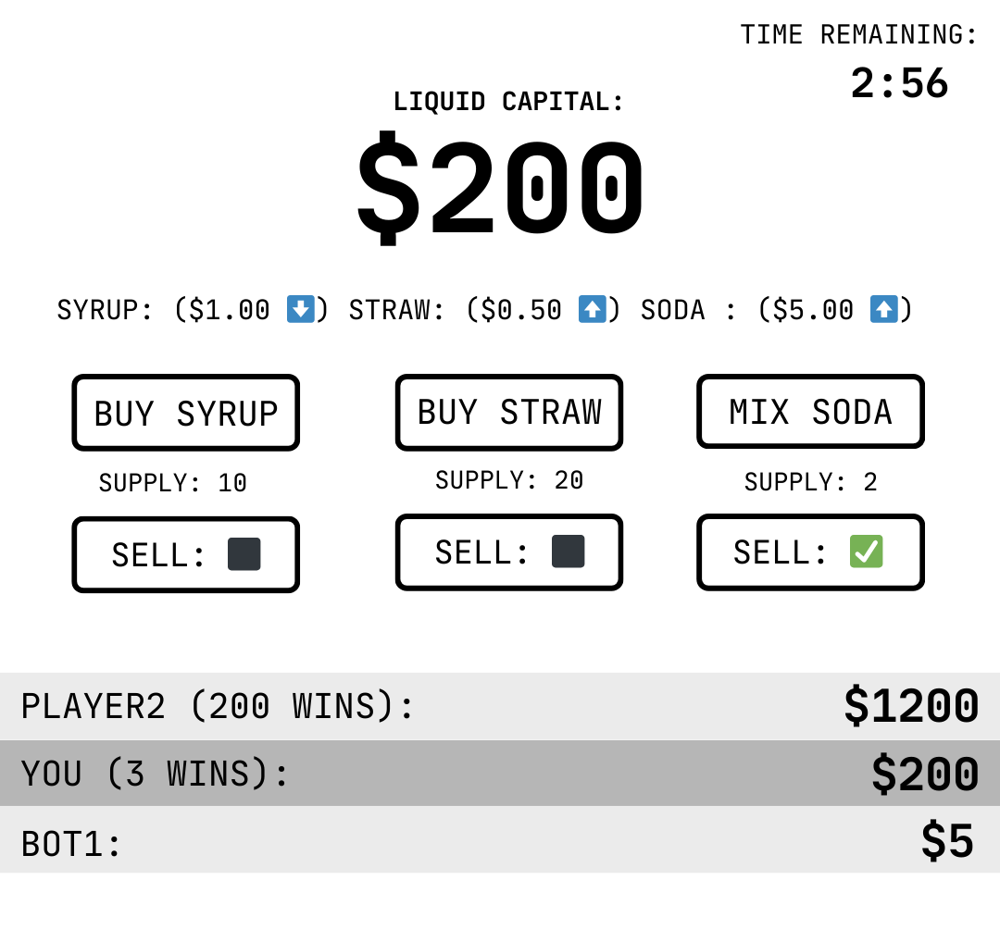

# SodaSim

### Elevator pitch

A minimalist 5-minute market simulator for the hottest commodity in happy valley. Buy, make, and sell soda, syrup, and straws to game the market and put the other soda shops out of business.

### Design

### Key features

- Secure login over HTTPS
- Simple supply/demand simulation
- Ability to buy and sell 3 key commodities
- Live updating company leaderboards
- Auto-trading companies for people without friends
- Leaderboards reset every 5 minutes
- Persistent win tracking

### Technologies

I am going to use the required technologies in the following ways.

- **HTML** - Classy front end with a page for login and a page for gameplay.
- **CSS** - Simple styling to mantain a clean appearance on all screen sizes.
- **React** - Login, leaderboard and market display, buying and selling functionality.
- **Service** - Endpoints for:
    - Generating market prices based on truly random seeds from random.org
    - Registering, login, and logout
- **DB/Login** - Store users and wins.
- **WebSocket**
    - Submitting and retrieving leaderboard and market changes.
    - Enforcing 5 minute timer.
